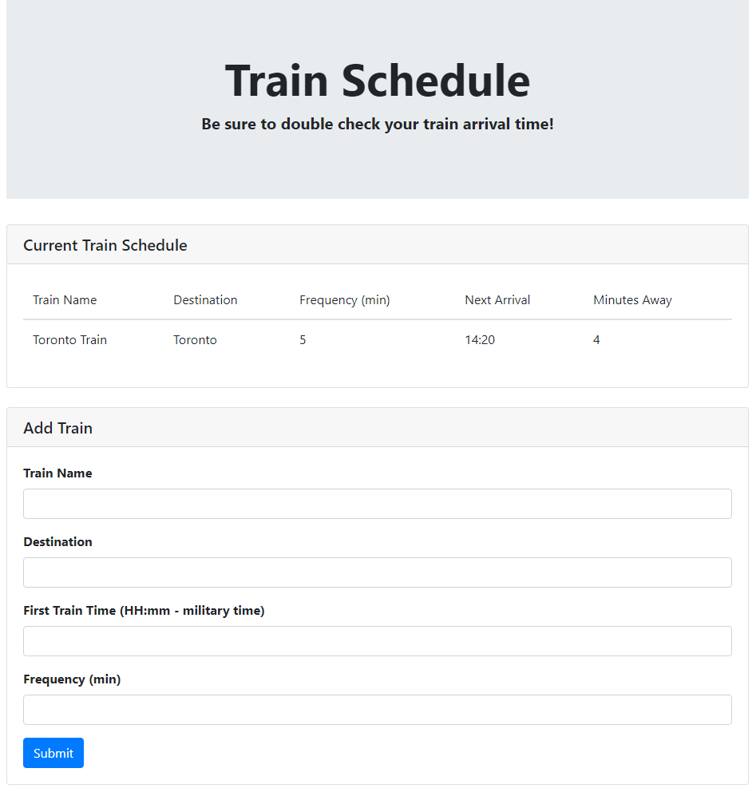

# Train-Scheduler

https://tleytek.github.io/Train-Scheduler/

## About

This application was made to showcase the use of Google's Firebase database and Moment.js.

## Instructions

This application is made so that users can create a train schedule themselves with some basic information.
The user will need the trains:

- Name
- Destination
- The very first arrival time
- Amount of time between stops (Frequency in minutes)

With this information the application will be give the next arrival time of the train and time until arrival.

